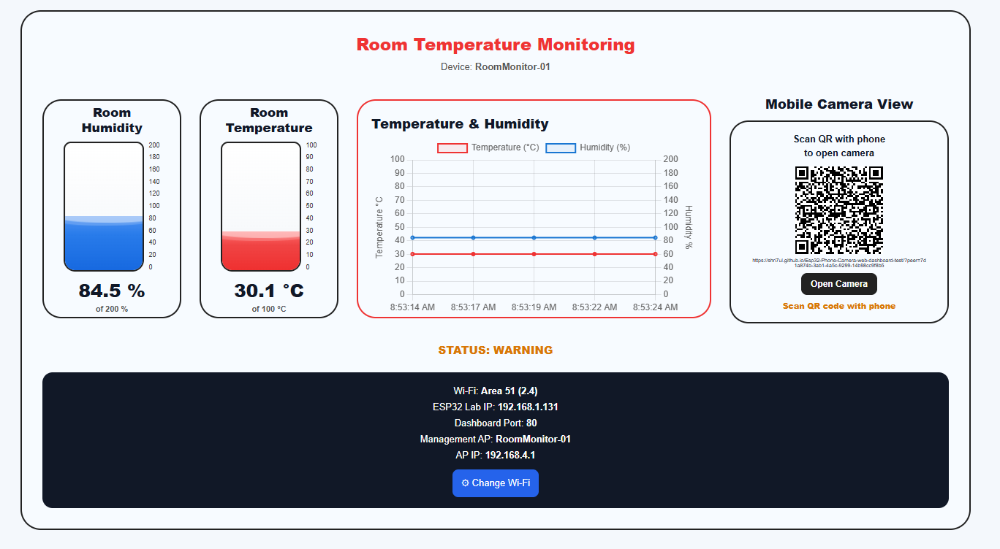

# ESP32 Phone Camera Web Dashboard

A lightweight IoT-based room monitoring system built with an **ESP32-S3**, **DHT22 sensor**, and a web-based dashboard.

The system monitors room temperature and humidity in real time and provides a visual dashboard with animated gauges, historical graphs, and a **mobile phone camera streaming feature using WebRTC and PeerJS**.

The ESP32 does not require a physical camera module. Instead, a smartphone camera is connected to the dashboard through a secure web page and WebRTC.

---

## Dashboard



---

## Features

- 🌡️ Real-time room temperature monitoring
- 💧 Real-time humidity monitoring
- 📊 Temperature & humidity graph
- 🌊 Animated water-style humidity gauge
- 🌡️ Animated temperature gauge
- 📱 Mobile phone camera integration
- 📷 Live phone camera view inside the dashboard
- 🔗 QR-code based camera connection
- 🌐 ESP32-hosted local web dashboard
- 📡 Wi-Fi Station + Access Point mode
- ⚙️ Wi-Fi configuration through the ESP32
- 💾 Persistent Wi-Fi configuration
- 🚨 Normal / Warning / Critical monitoring status
- 📱 No dedicated camera module required

---

## System Architecture

```text
                  ┌──────────────────┐
                  │      DHT22       │
                  │ Temperature &    │
                  │     Humidity     │
                  └────────┬─────────┘
                           │
                        GPIO 1
                           │
                           ▼
                  ┌──────────────────┐
                  │     ESP32-S3     │
                  │                  │
                  │ Sensor Reading   │
                  │ Web Server       │
                  │ Wi-Fi            │
                  │ AP + STA         │
                  └────────┬─────────┘
                           │
                    Local Network
                           │
                           ▼
                  ┌──────────────────┐
                  │    Dashboard     │
                  │                  │
                  │ Temperature      │
                  │ Humidity         │
                  │ Graph            │
                  │ Camera View      │
                  └────────┬─────────┘
                           │
                      PeerJS/WebRTC
                           │
                           ▼
                  ┌──────────────────┐
                  │   Mobile Phone   │
                  │      Camera      │
                  └──────────────────┘
```

---

## Hardware

### Required Components

| Component | Purpose |
|---|---|
| ESP32-S3 | Main controller |
| DHT22 | Temperature & humidity sensor |
| Smartphone | Camera source |

No external camera module is required.

---

## DHT22 Wiring

```text
DHT22          ESP32-S3
------------------------
VCC      --->   3.3V
GND      --->   GND
DATA     --->   GPIO1
```

For a bare DHT22 sensor, use an appropriate pull-up resistor between DATA and 3.3V if the sensor module does not already include one.

---

## Phone Camera System

The phone camera is handled entirely by the smartphone browser.

The ESP32 dashboard generates a unique **PeerJS ID** and creates a QR code containing the camera page URL.

The connection flow is:

```text
ESP32 Dashboard
       │
       ▼
Generate Peer ID
       │
       ▼
Generate QR Code
       │
       ▼
Scan QR with Phone
       │
       ▼
HTTPS Camera Page
       │
       ▼
Browser Camera Permission
       │
       ▼
Phone Camera
       │
       ▼
WebRTC / PeerJS
       │
       ▼
Dashboard Video
```

This allows the smartphone camera to appear directly inside the ESP32 dashboard.

---

## Why WebRTC?

WebRTC provides real-time browser-to-browser media communication.

The actual camera stream does not need to be processed by the ESP32.

Instead:

```text
Phone Browser
     │
     │ Camera Stream
     ▼
   WebRTC
     │
     ▼
Dashboard Browser
```

This significantly reduces the processing and bandwidth requirements on the ESP32.

---

## QR Code Camera Connection

The dashboard generates a URL similar to:

```text
https://shri7ul.github.io/Esp32-Phone-Camera-web-dashboard-test/?peer=YOUR_PEER_ID
```

The phone opens this secure page after scanning the QR code.

After granting camera permission, the phone camera is streamed to the dashboard.

---

## Wi-Fi Architecture

The ESP32 supports both Station Mode and Access Point Mode.

### Station Mode

The ESP32 connects to the laboratory/local Wi-Fi network.

Example:

```text
ESP32 Lab IP:
192.168.1.131
```

The dashboard can then be opened from a device connected to the same local network.

### Access Point Mode

The ESP32 also provides its own management Wi-Fi network.

```text
SSID:     RoomMonitor-01
Password: 12345678
AP IP:    192.168.4.1
```

This allows Wi-Fi configuration and device management without requiring a PC or serial monitor.

---

## Dashboard Components

### Temperature

The dashboard displays the current room temperature and an animated temperature gauge.

The temperature gauge uses a:

```text
0–100 °C
```

scale.

### Humidity

The humidity gauge uses a:

```text
0–200 %
```

visual scale.

The animated liquid level is calculated from the current humidity value.

For example:

```text
Humidity = 76.2%

Fill percentage =
76.2 / 200 × 100

= 38.1%
```

The animated wave is a visual representation of the current sensor value.

---

## Data Visualization

The dashboard uses a real-time graph containing:

- Temperature
- Humidity
- Timestamped readings

The graph keeps a limited number of recent readings to prevent unlimited browser-side data growth.

---

## Alert Status

The monitoring system provides three basic states:

```text
NORMAL
WARNING
CRITICAL
```

The status is determined from the configured temperature and humidity thresholds.

---

## Technologies

### Embedded

- C++
- Arduino Framework
- ESP32-S3
- DHT22
- ESP32 WebServer
- ESP32 Preferences

### Web

- HTML
- CSS
- JavaScript
- Chart.js
- QRCode.js

### Camera

- Browser `getUserMedia()`
- WebRTC
- PeerJS
- HTTPS / GitHub Pages

---

## Repository Structure

```text
Esp32-Phone-Camera-web-dashboard-test/
│
├── dashboard/
│   └── ESP32 dashboard related files
│
├── onlyDHT22Check/
│   └── DHT22 testing code
│
├── index.html
│   └── Phone camera web application
│
├── image.png
│   └── Dashboard screenshot
│
├── LICENSE
├── README.md
└── .gitignore
```

---

## How It Works

1. ESP32 starts and initializes the DHT22 sensor.
2. ESP32 connects to the configured Wi-Fi network.
3. ESP32 starts its local web server.
4. The dashboard is opened from the ESP32 IP address.
5. Temperature and humidity data are periodically requested from the ESP32.
6. Chart.js updates the monitoring graph.
7. The dashboard creates a PeerJS connection.
8. A unique Peer ID is generated.
9. A QR code containing the phone camera URL is displayed.
10. The user scans the QR code using a smartphone.
11. The phone opens the HTTPS camera page.
12. The user grants camera permission.
13. WebRTC establishes the media connection.
14. The live phone camera appears in the dashboard.

---

## Example

Dashboard:

```text
Temperature: 32.2 °C
Humidity:    76.2 %
Status:      WARNING
```

Phone camera:

```text
● PHONE CAMERA LIVE
```

---

## Future Improvements

Possible future extensions include:

- Multiple phone camera support
- Sensor data logging
- Cloud database integration
- Historical data storage
- Authentication
- Multiple ESP32 device management
- Additional environmental sensors
- Mobile-responsive dashboard improvements
- Offline dashboard support

---

## Author

**Shriful Islam (InHumanZ)**

---

## License

This project is licensed under the MIT License.
